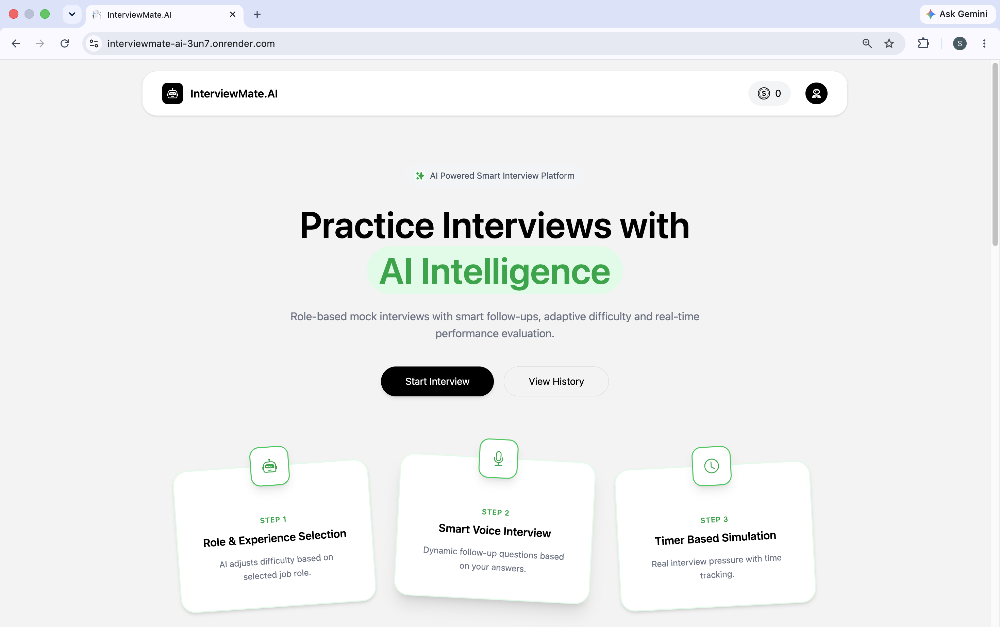
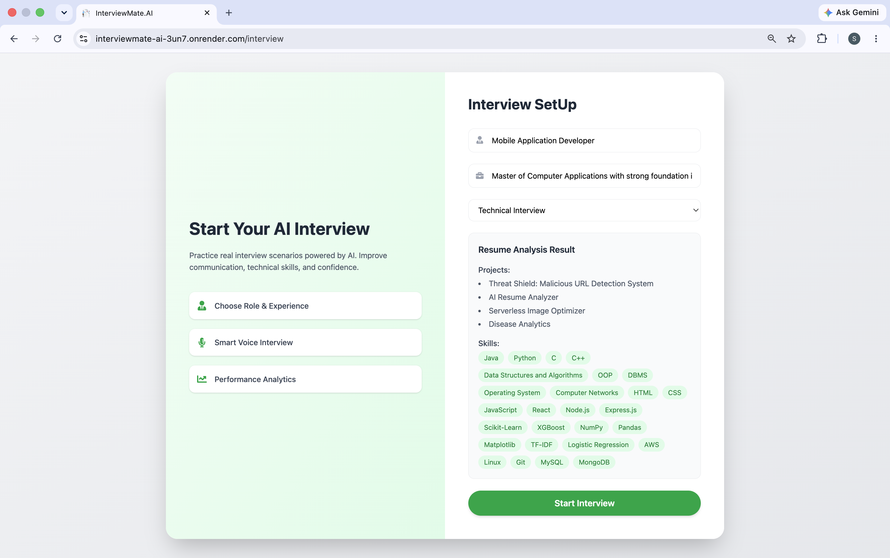
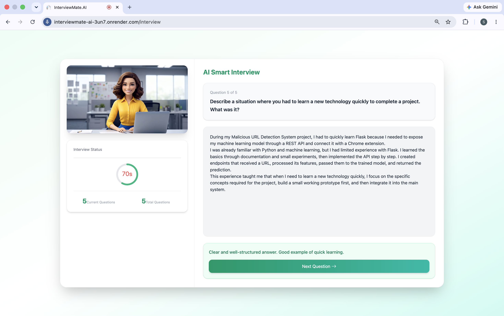
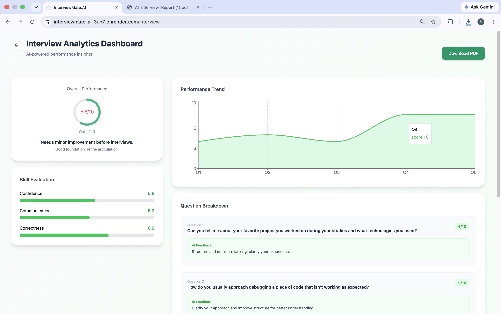
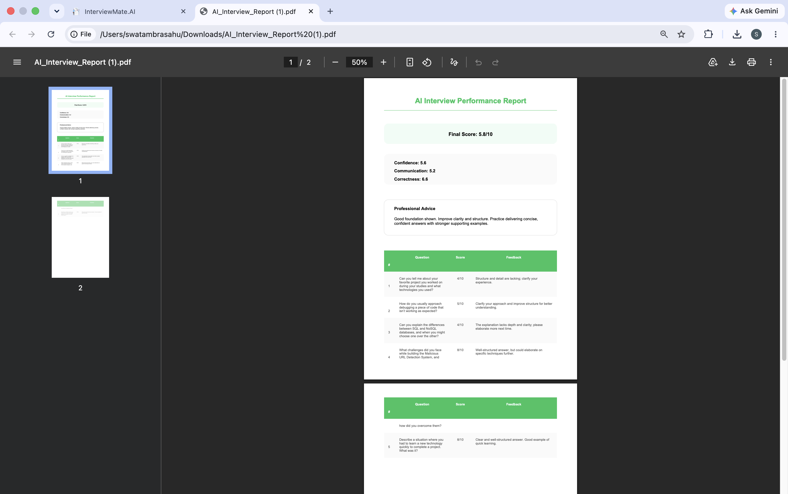
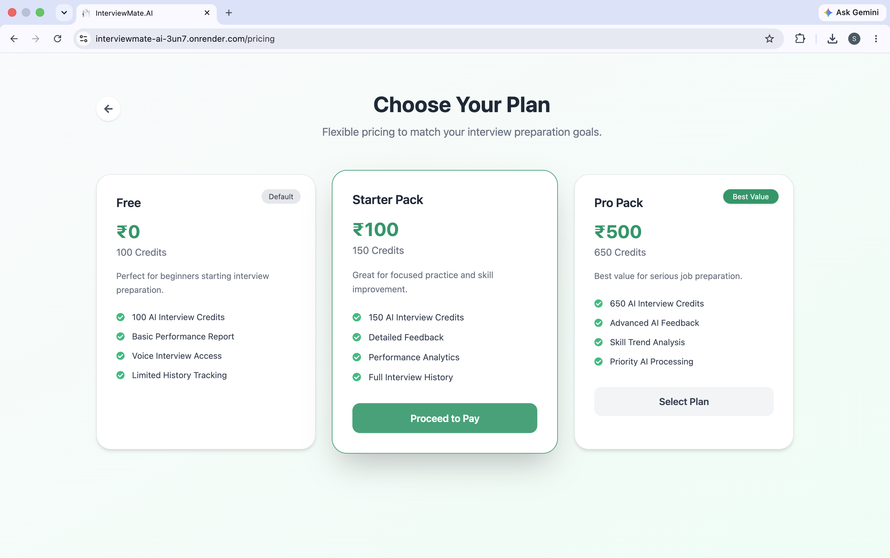
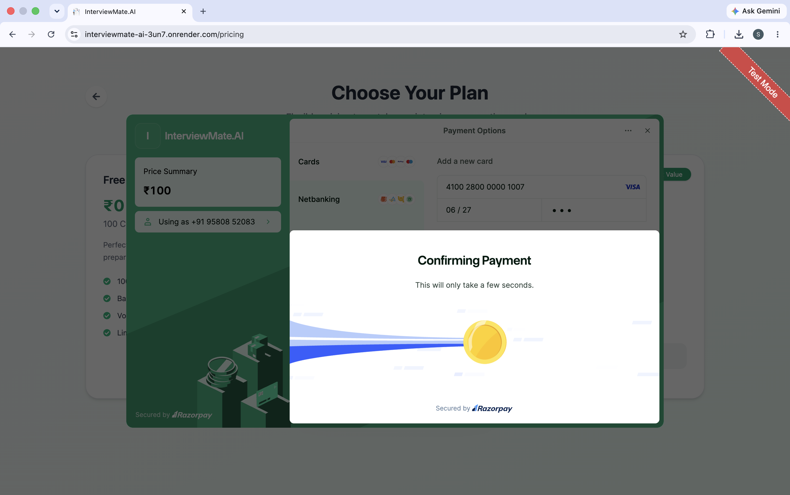
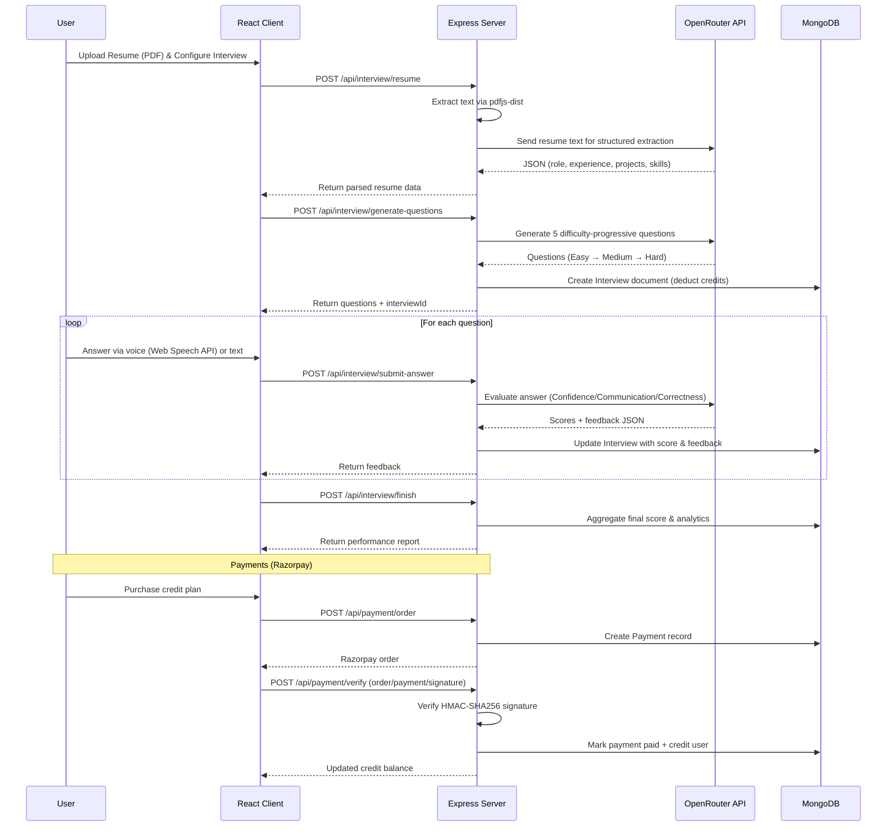

<div align="center">

# 🤖 InterviewMate.AI

### *AI-Powered Mock Interview Platform for Career Success*

Practice realistic, role-specific interviews generated from your own resume, answer by voice or text, and get instant, structured feedback on Confidence, Communication, and Correctness — all in one full-stack web app.

[](https://react.dev/)
[](https://nodejs.org/)
[](https://expressjs.com/)
[](https://www.mongodb.com/)
[](https://tailwindcss.com/)
[](https://openrouter.ai/)

**🔗 [Live Demo](https://interviewmate-ai-3un7.onrender.com/)** &nbsp;·&nbsp; **🎬 [Watch Video Demo](https://your-youtube-demo-link.com)**

</div>

## 🖥️ Product Experience

### 🏠 Home Page

<div align="center">



<p><strong>Modern, responsive landing experience</strong> — clearly communicates the platform's AI-powered interview workflow, key capabilities, and value proposition for candidates.</p>

</div>

## 📸 Platform Features & Gallery

<div align="center">

| | |
|:---:|:---:|
|  |  |
| **📄 Resume Parsing** — Upload a PDF and let AI auto-extract role, skills, experience & projects | **🎙️ AI Mock Interview** — Voice-driven Q&A with a realistic, adaptive AI interviewer |
|  |  |
| **📊 Performance Analytics** — Interview history with score trends over time | **🧠 3D Scoring Report** — Confidence, Communication & Correctness breakdown per question |
|  |  |
| **💳 Pricing & Payments** — Razorpay-powered credit plans for continued practice | **💳 Razorpay Integration** — Secure payment flow for purchasing interview credits |

</div>

---

## ✨ Core Features

| Feature | Description |
|---------|-------------|
| 🎯 **AI Mock Interviews** | Powered by the **OpenRouter API** — generates 5 role-specific, difficulty-progressive questions (Easy → Medium → Hard) based on your resume, role, and experience level |
| 📄 **Smart Resume Parsing** | PDF resume analysis using `pdfjs-dist` to extract raw text, then AI-structures it into role, experience, projects, and skills |
| 🎤 **Voice-to-Text Interaction** | Web Speech API integration lets candidates answer questions naturally by speaking instead of typing |
| 📊 **3D Scoring System** | Every answer is scored across three dimensions — **Confidence**, **Communication**, and **Correctness** — with a weighted final score and human-style feedback |
| 🕒 **Timed Responses** | Per-question time limits (60s–120s based on difficulty) enforce realistic interview pressure |
| 💳 **Credit-Based Monetization** | Razorpay integration with tiered credit plans (Free → Starter → Pro); each interview consumes credits |
| 🔐 **Secure Payment Verification** | Server-side **HMAC-SHA256** signature verification of Razorpay order/payment IDs before crediting a user's account |
| 🔑 **Google Authentication** | Firebase-based Google Sign-In with JWT cookie sessions for secure, passwordless auth |
| 📈 **Interview History & Reports** | Every interview is persisted to MongoDB with per-question breakdowns, viewable anytime from the history dashboard |
| 📱 **Responsive UI** | Mobile-first design built with Tailwind CSS v4 and Framer Motion animations |

---

## 🛠️ Tech Stack

<table>
<tr>
<td valign="top" width="33%">

### Frontend
- **React 19** with Vite
- **Redux Toolkit** for state management
- **Tailwind CSS v4** (Vite plugin)
- **Framer Motion** animations
- **React Router v7** navigation
- **Recharts** for data visualization

</td>
<td valign="top" width="33%">

### Backend
- **Node.js** + **Express 5**
- **MongoDB** with Mongoose ODM
- **JWT** cookie-based authentication
- **Multer** for file uploads
- RESTful API architecture

</td>
<td valign="top" width="33%">

### Integrations
- **OpenRouter API** for LLM orchestration (question generation, resume parsing & answer evaluation)
- **Razorpay** payment gateway
- **Web Speech API** (voice-to-text)
- **Firebase** (Google Authentication)
- **pdfjs-dist** PDF parsing

</td>
</tr>
</table>

> **Note:** All AI features are powered through the **OpenRouter API**, which routes chat-completion requests to an underlying LLM (`openai/gpt-4o-mini`). This gives the project a single, provider-agnostic AI integration point instead of being locked into a specific vendor SDK.

---

## 🏗️ Technical Highlights

<details>
<summary><strong>🤖 AI Interview Pipeline (via OpenRouter)</strong></summary>

```
Resume Upload → PDF Parsing (pdfjs-dist) → OpenRouter Extraction → Question Generation
                                                                          ↓
User Answer (voice/text) → OpenRouter Evaluation → 3D Scoring → Feedback Display
```

- All prompts are sent to `openrouter.ai/api/v1/chat/completions` via a single `askAi()` service
- Structured system prompts enforce consistent JSON responses for parsing and scoring
- Difficulty progression: Easy → Easy → Medium → Medium → Hard
- Per-question scoring across 3 dimensions (Confidence, Communication, Correctness) with weighted averages
- Per-question time limits (60s–120s) enforced server-side before evaluation

</details>

<details>
<summary><strong>🔐 Secure Payment Flow</strong></summary>

- Server-side Razorpay order creation, persisted to MongoDB with a `created` status
- **HMAC-SHA256** signature validation (`order_id|payment_id` signed with the Razorpay key secret) before crediting a user's account
- Idempotent payment processing to prevent duplicate credit allocation
- Credits are atomically incremented on the user document only after signature verification succeeds

</details>

<details>
<summary><strong>🎤 Voice-First Experience</strong></summary>

- Web Speech API captures spoken answers and converts them to text in real time
- Countdown timer per question enforces realistic interview pressure
- Seamless fallback to manual text input

</details>

---

## 🚀 Getting Started

### Prerequisites

- Node.js 18+
- MongoDB instance (local or Atlas)
- **OpenRouter API key** ([openrouter.ai](https://openrouter.ai/)) — powers all AI features
- Razorpay account (for payments)
- Firebase project (for Google Authentication)

### Installation

```bash
# Clone the repository
git clone https://github.com/yourusername/InterviewMate-AI.git
cd InterviewMate-AI
```

#### Backend Setup

```bash
cd server
npm install
```

Create `server/.env`:

```env
PORT=6000
MONGODB_URL=mongodb://localhost:27017/interviewmate
JWT_SECRET=your_jwt_secret_key

# OpenRouter (LLM orchestration)
OPENROUTER_API_KEY=your_openrouter_api_key_here

# Razorpay
RAZORPAY_KEY_ID=rzp_test_xxxxxxxxxxxxx
RAZORPAY_KEY_SECRET=xxxxxxxxxxxxxxxxxxxxx
```

```bash
npm run dev  # Starts server on port 6000
```

#### Frontend Setup

```bash
cd client
npm install
```

Create `client/.env`:

```env
VITE_RAZORPAY_KEY_ID=rzp_test_xxxxxxxxxxxxx
VITE_FIREBASE_API_KEY=your_firebase_api_key
```

```bash
npm run dev  # Starts client on port 5173
```

---

## 📁 Project Architecture

```
InterviewMate-AI/
├── assets/                       # Project screenshots used in README
│   ├── Home-Page.png
│   ├── AI-Capabilities.png
│   ├── Multiple-Interview-Modes.png
│   ├── interview-history.png
│   ├── mock-interview.png
│   ├── performance-analytics.png
│   ├── pricing.png
│   ├── razorpay.png
│   ├── resume-parsin.png
│   └── scoring-report.png
│
├── client/                       # React Frontend (Vite)
│   ├── src/
│   │   ├── components/           # Reusable UI components
│   │   │   ├── Step1SetUp.jsx
│   │   │   ├── Step2Interview.jsx
│   │   │   ├── Step3Report.jsx
│   │   │   ├── Timer.jsx
│   │   │   ├── AuthModel.jsx
│   │   │   └── Navbar.jsx / Footer.jsx
│   │   ├── pages/
│   │   │   ├── Home.jsx, InterviewPage.jsx
│   │   │   ├── InterviewHistory.jsx, InterviewReport.jsx
│   │   │   ├── Pricing.jsx, Auth.jsx
│   │   ├── redux/
│   │   └── utils/firebase.js
│   └── vite.config.js
│
└── server/                       # Node.js + Express 5 Backend
    ├── controllers/
    ├── models/
    ├── middlewares/
    ├── services/
    └── routes/
```

---

## 🔄 System Architecture & API Flow



---

## 📄 License

This project is licensed under the MIT License - see the [LICENSE](LICENSE) file for details.

---

<div align="center">

**Built with ❤️ for aspiring professionals**

⭐ Star this repo if it helped you prepare for interviews!

</div>
